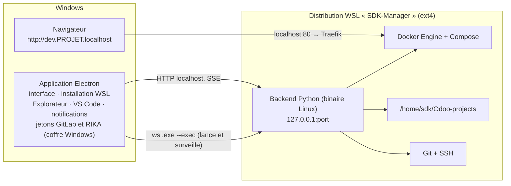

# Proposition : SDK Local Manager sur WSL — 17 septembre 2026

## Objectif

Sous Windows, faire tourner les projets Odoo, Docker et le backend du gestionnaire dans WSL, sur un système de fichiers Linux, sans demander à l'utilisateur d'ouvrir un terminal ni de configurer quoi que ce soit : il installe l'application, clique sur **Préparer mon poste**, et l'outil est prêt.

macOS et Linux ne changent pas.

## Pourquoi

Mesures du même jour sur `SIMPAC_v16` (audit `audit-performances-windows-2026-09-17.md`) :

| Opération | Aujourd'hui (fichiers sur `C:\`) | Fichiers Linux (volume Docker) |
|---|---:|---:|
| Démarrage d'Odoo 16 (248 modules) | 48 à 95 s | 4 à 6 s |
| `-u base` | 370 à 504 s | 234 s |
| Restauration d'une base de 1,1 Go | 296 s | 154 s |
| Recherche des manifestes d'addons | 31 à 38 s | 1,2 s |

Un workspace dans WSL place code, filestore et PostgreSQL sur le même ext4 que ces volumes. Les chiffres attendus sont ceux de la colonne de droite, à confirmer par le prototype (lot 0).

## Architecture proposée

### Une distribution dédiée, avec son propre Docker Engine

| | A. Ubuntu de l'utilisateur + Docker Desktop | **B. Distribution dédiée `SDK-Manager`** |
|---|---|---|
| Étapes manuelles | Installer Docker Desktop, accepter ses conditions, activer l'intégration WSL par distribution, créer l'utilisateur Ubuntu | Aucune : image importée par l'application |
| Versions (Docker, Git, OpenSSH, clés d'hôte) | Celles du poste, variables | Figées dans l'image, testées en CI |
| Effet sur le poste | Modifie la distribution personnelle | Isolée, désinstallable proprement |
| Docker | Moteur dans la VM `docker-desktop`, CLI par intégration | Moteur local à la distribution, socket Unix |
| Dépendance | Docker Desktop (installation, mises à jour, conditions de licence selon la taille de l'entreprise) | Aucune hors WSL |

**Recommandation : B.** C'est la seule option qui tient la promesse « un clic ». Toutes les distributions WSL 2 partagent la même VM : une distribution de plus ne crée pas de seconde machine virtuelle.

Sur ce poste, Ubuntu ne voit que le `docker.exe` de Windows (`/mnt/c/Program Files/Docker/…`) : l'intégration WSL de Docker Desktop n'y est pas activée. C'est typiquement l'étape manuelle que l'option A imposerait.

### Le backend tourne dans WSL

Le backend n'utilise que la bibliothèque standard, et la CI produit déjà un exécutable Linux (`ubuntu-22.04`). Exécuté dans la distribution, il lit les projets sur ext4 et appelle Docker et Git directement :

- plus de `wsl.exe` par commande, plus de traduction de chemins, plus de liens WSL illisibles par Windows (`windows_links.py`, `wsl_module_dirs`, `WSL_DRIVE_MOUNTS` deviennent inutiles dans ce mode) ;
- les liens d'addons sont des liens Linux relatifs ordinaires ;
- la résolution de `dev.PROJET.localhost` fonctionne (constat 14 du 16/09 sans objet).

Vérifié sur ce poste :

| Contrôle | Résultat |
|---|---|
| Serveur lié à `127.0.0.1` dans WSL, appelé depuis Windows (réseau NAT par défaut) | Accessible, premier accès en 2,8 s avec la distribution arrêtée |
| Surcoût par requête HTTP (nouvelle connexion) | environ 10 ms (28,5 ms depuis Windows, 18,3 ms dans WSL, sur `http.server`) |
| Processus Linux après arrêt brutal de `wsl.exe` | Arrêté : pas de backend orphelin (constat 11 du 16/09 résolu par construction) |
| `wsl --install --from-file --name --location --no-launch`, `wsl --manage --set-sparse` | Disponibles (WSL 2.4.12) |

L'application Electron garde ce qui doit rester côté Windows : fenêtre, sélecteur de dossier, notifications, jetons GitLab et identifiants RIKA (coffre `safeStorage`), ouverture de l'Explorateur, de VS Code et du navigateur.

## Parcours utilisateur

### Installation (une fois)

1. **Télécharger et lancer l'installateur** (signé, constat 9 du 16/09). Installation par utilisateur, sans droits administrateur.
2. **Premier lancement : un écran, un bouton « Préparer mon poste »**, puis une liste d'étapes avec progression :

| Étape | Ce que fait l'application | Interaction |
|---|---|---|
| Vérifier Windows | Windows 10 22H2 ou 11, virtualisation active, WSL autorisé par la stratégie du poste | Message clair si bloquant (ex. virtualisation désactivée dans le BIOS) |
| Installer WSL, si absent | `wsl --install --no-distribution` | **Une** demande UAC ; si un redémarrage est requis, bouton « Redémarrer » et reprise automatique au lancement suivant |
| Installer l'environnement | `wsl --install --from-file sdk-manager-<version>.wsl --name SDK-Manager --location "%LOCALAPPDATA%\SDK Local Manager\wsl" --no-launch`, empreinte SHA-256 vérifiée, puis `--set-sparse true` | Aucune |
| Démarrer | Distribution avec systemd : Docker démarre, puis le backend | Aucune |
| Identité Git | Reprise de `user.name` et `user.email` de Git pour Windows s'ils existent | Champs préremplis, modifiables |
| Clé SSH GitLab | Clé existante dans `%USERPROFILE%\.ssh` : « Utiliser ma clé » (copiée dans la distribution, droits 600). Sinon génération Ed25519, affichage de la clé publique et ouverture de GitLab | Coller la clé dans GitLab, bouton « Vérifier » (`ssh -T -p 10022`) |
| Traefik | Installation et démarrage automatiques | Aucune |
| Éditeur | VS Code détecté : installation de l'extension WSL (`code --install-extension ms-vscode-remote.remote-wsl`) | Case cochée par défaut |

La clé d'hôte de `gitlab.sudokeys.com:10022` est préinstallée dans l'image : aucun `Host key verification failed` au premier clone (constat 6 du 16/09).

### Au quotidien

- L'application lance `wsl.exe -d SDK-Manager --exec /opt/sdk-manager/backend --port <port>`, vérifie `/api/health` et l'identité d'instance comme aujourd'hui.
- **Ouvrir le code** : bouton « Ouvrir dans VS Code » (`code --remote wsl+SDK-Manager /home/sdk/Odoo-projects/PROJET`) et « Ouvrir dans l'Explorateur » (`\\wsl.localhost\SDK-Manager\home\sdk\Odoo-projects\PROJET`). L'interface recommande VS Code en mode WSL : éditer ces fichiers depuis un outil Windows repasse par le pont 9P, dans l'autre sens.
- **Odoo** reste accessible à `http://dev.PROJET.localhost/`.
- Un terminal (« Ouvrir un terminal », console `psql`) s'ouvre dans Windows Terminal sur la distribution.

## Migration des projets existants

Un bandeau « Migrer vers l'environnement rapide » sur chaque projet encore sur `C:\` :

1. Arrêt du projet.
2. **Base** : `pg_dump` dans l'ancien conteneur, restauration dans le nouveau (154 s mesurées pour 1,1 Go).
3. **Code** : nouveau clone depuis GitLab dans WSL des dépôts Odoo, Enterprise et addons, à la même révision. Copier depuis `C:\` est lent (23 min mesurées pour les 135 000 fichiers de `SIMPAC_v16`). Un dépôt modifié localement (`git status` non vide) ou un module importé par ZIP est copié tel quel.
4. **Fichiers locaux** : `odoo.conf`, filestore et imports gérés par l'outil sont copiés.
5. **Liens** : recréés comme liens Linux relatifs.
6. **Ancien projet** : conservé sur `C:\` jusqu'à confirmation, puis déplacé dans `.odoo_manager_deleted/` comme une suppression actuelle.

Chaque étape est reprenable, comme la conversion des liens WSL. Le nettoyage des 6,8 Go de `.odoo_manager_staging` peut être proposé au même moment.

## Contenu de l'image `sdk-manager.wsl`

Construite en CI à partir d'un `Dockerfile` (`docker build` puis `docker export`), publiée avec chaque version :

- base Debian 12 ou Ubuntu 24.04 minimale, systemd ;
- Docker Engine et le plugin Compose, rotation des journaux des conteneurs ;
- Git, OpenSSH client et `known_hosts` de GitLab Sudokeys ;
- utilisateur `sdk` (uid 1000) par défaut ;
- `/etc/wsl.conf` : `systemd=true`, utilisateur par défaut, `appendWindowsPath=false` (évite que `docker` ou `git` se résolvent vers les exécutables Windows, comme sur l'Ubuntu de ce poste) ;
- `/etc/sdk-manager-release` : version de l'image.

Les mises à jour de l'application ne réimportent jamais la distribution : un script de provisionnement idempotent, versionné, s'exécute quand la version change (paquets, configuration). Le binaire du backend est copié dans `/opt/sdk-manager/` à chaque mise à jour.

## Modifications du code

| Zone | Changement |
|---|---|
| `electron/` | Nouveau module d'installation WSL (détection, `wsl --install`, import, reprise après redémarrage, progression) exécuté avant le backend. `Backend` lance `wsl.exe` sous Windows et passe le port en argument. `configuredPort` ne lit plus `%APPDATA%` dans ce mode. Nouveaux IPC : ouvrir dans VS Code, ouvrir dans l'Explorateur, ouvrir un terminal WSL |
| `app/page.tsx` | Écran « Préparer mon poste », bandeau de migration, boutons VS Code et Explorateur. L'assistant actuel (Git via winget, mode développeur) disparaît sous Windows |
| Backend | Aucune logique Windows en mode WSL. Les jetons GitLab et RIKA restent côté Electron, transmis à la demande. Le mode Windows natif est conservé pendant la transition |
| Build et CI | L'installateur Windows embarque le backend Linux (artefact du job Ubuntu) et l'image `.wsl` (ou son URL et son empreinte). Nouveau job de construction de l'image |
| Désinstallation | Ne supprime jamais la distribution par défaut. Case décochée « Supprimer aussi l'environnement et les projets (N Go) », avec proposition d'export (`wsl --export`) |

## Plan de mise en œuvre

| Lot | Contenu | Critère de sortie |
|---|---|---|
| 0. Prototype | Distribution construite à la main, backend Linux dedans, interface de développement pointée dessus | Mesures sur `SIMPAC_v16` : démarrage d'Odoo, `-u base`, liste des modules, overview. Réponses aux points à vérifier ci-dessous |
| 1. Image | `Dockerfile`, job CI, script de provisionnement | Image importée et démarrée sur un Windows vierge |
| 2. Installation en un clic | Module Electron, écran, reprise après redémarrage, clé SSH, Traefik | Poste neuf prêt sans terminal |
| 3. Backend dans WSL | Lancement, intégrations Windows, terminal | Recette complète du 17/09 rejouée dans WSL |
| 4. Migration | Assistant par projet | Caritel, DEMO_CPL et SIMPAC migrés sans perte |
| 5. Distribution | Signature, CI | Installateur signé publié |
| 6. Retrait | Suppression du mode Windows natif après une période de transition | — |

Les runners `windows-latest` de GitHub n'exécutent pas WSL 2 (constat 4 du 16/09). Les lots 2 à 4 demandent un runner Windows auto-hébergé, ou une recette manuelle scriptée par version.

## Points à vérifier au lot 0

- **Arrêt de la VM** : WSL arrête une distribution inactive quand plus aucun processus lancé depuis Windows ne tourne. Les projets doivent-ils continuer quand l'application est fermée ? Si oui, garder un processus `wsl.exe` léger (icône dans la zone de notification) tant qu'un projet tourne.
- **Port 80** : redirection de `localhost:80` vers Traefik dans la distribution, et conflits avec Traefik de Docker Desktop, IIS ou un autre service.
- **VPN et proxy d'entreprise** : le réseau NAT de WSL perd souvent le DNS derrière un VPN. Le mode `networkingMode=mirrored` avec `dnsTunneling` (Windows 11 22H2+) est le remède habituel ; il se règle dans `.wslconfig`, commun à toutes les distributions : à proposer, jamais à imposer.
- **Coexistence avec Docker Desktop** pendant la transition : deux moteurs, images en double, port 80.
- **Mémoire** : la VM WSL prend jusqu'à 50 % de la RAM par défaut. Réglage proposé dans les paramètres, écrit dans `.wslconfig` avec accord.
- **Taille** de l'image et du disque virtuel, compactage (`--set-sparse`).
- **EDR d'entreprise** : Defender n'analyse pas fichier par fichier le contenu du disque virtuel, ce qui fait partie du gain ; une politique de sécurité peut l'exiger.
- **Temps d'installation** depuis l'image locale, à mesurer.
